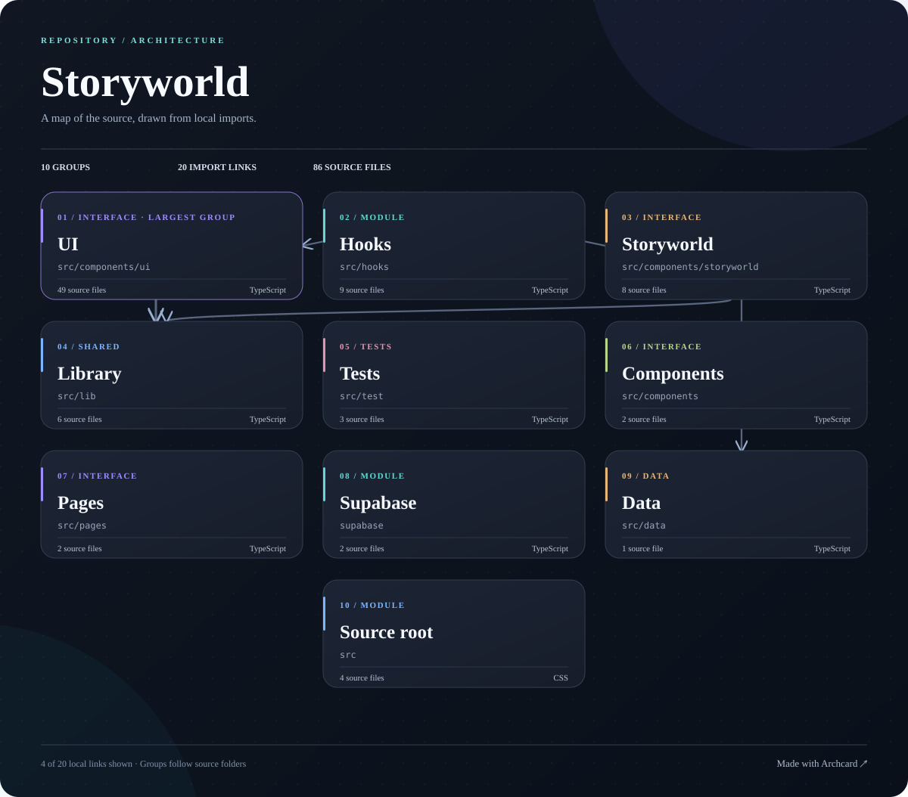

# Archcard

**A map of a codebase that belongs in its README.**

Archcard reads a repository and draws its source areas, folders, and direct file imports. It makes a compact SVG image for your README and a linked page with every source file and local import. The tool runs locally. It sends no source files to a model or hosted service.

[](https://github.com/skipauthenticate/lmstash/blob/main/docs/architecture-map.md)

This map is from [LMStash](https://github.com/skipauthenticate/lmstash). Open it to see the full source map.

## Try it

You need Node.js 20 or later, npm, and Git. Run this from the repository you want to map:

```bash
npx --yes github:skipauthenticate/archcard .
```

Archcard writes `docs/architecture.svg` and `docs/architecture-map.md`. It prints the lines to add to your README. You can also give it a public GitHub URL:

```bash
npx --yes github:skipauthenticate/archcard https://github.com/skipauthenticate/docky --out docky.svg
```

Open `docky.svg` to see the image and `docky-map.md` to follow the source links. Commit both files and add the printed image link to your README. Archcard does not edit your README or make a commit.

Use `--title LMStash` when you want to keep the exact capitalization of a project name.

## What the map shows

- The README image shows source areas, key folders, folder imports, and selected file imports.
- The linked page lists every scanned source file, each direct local import, and all folder links. File names link to the code.
- Large repositories keep the image readable. The linked page holds the full detail.

The map reflects the files at the time you generate it. It does not guess at runtime traffic, cloud services, or hidden dependencies.

## Keep it current

If you work with a coding agent, give it one rule: refresh the map after a change to folders or imports, then commit both map files with the code. [Setup for Codex, Claude Code, Cursor, Copilot, Gemini CLI, and OpenCode](docs/agents.md).

## Put it in your README

Copy these lines after you commit both files:

```md
[](docs/architecture-map.md)
[Made with Archcard](https://github.com/skipauthenticate/archcard)
```

The image opens the full source map. The credit links back to Archcard.

## How it works

[](docs/archcard-map.md)

The analyzer scans common source file types and groups them by directory. It follows recognized local imports in JavaScript, TypeScript, Python, and Rust. It keeps file links inside folders, too. It skips dependencies and build output. The renderer writes a self-contained SVG, so the image works in a GitHub README without a separate server.

The tool reads files from your local checkout. For a public GitHub URL, it first clones the repository to a temporary folder. It does not need an account or API key. A private repository must be available as a local checkout.

Archcard does not trace runtime calls or every language's import syntax. If a line is missing, check the source before you trust the picture.

## Other tools

[GitDiagram](https://github.com/ahmedkhaleel2004/gitdiagram) and [CodeBoarding](https://github.com/CodeBoarding/CodeBoarding) offer interactive views. [RepoArch](https://github.com/dsk-dev-ai/repoarch) makes local Mermaid and HTML diagrams. [Squinch](https://github.com/jquatier/squinch) draws polished diagrams from a model that a person or agent writes. Archcard focuses on a local, one-command README image with a complete, linked source map behind it.

## Project layout

```text
bin/archcard.js  Read arguments, clone public URLs, write both maps
src/analyze.js   Scan source files and find local imports
src/render.js    Draw the SVG
src/report.js    Write the linked source map
test/            Small fixtures for parsing and safe SVG output
docs/agents.md   Agent instructions for keeping a map current
```

## Contributing

See [CONTRIBUTING.md](CONTRIBUTING.md). Archcard is MIT licensed.
