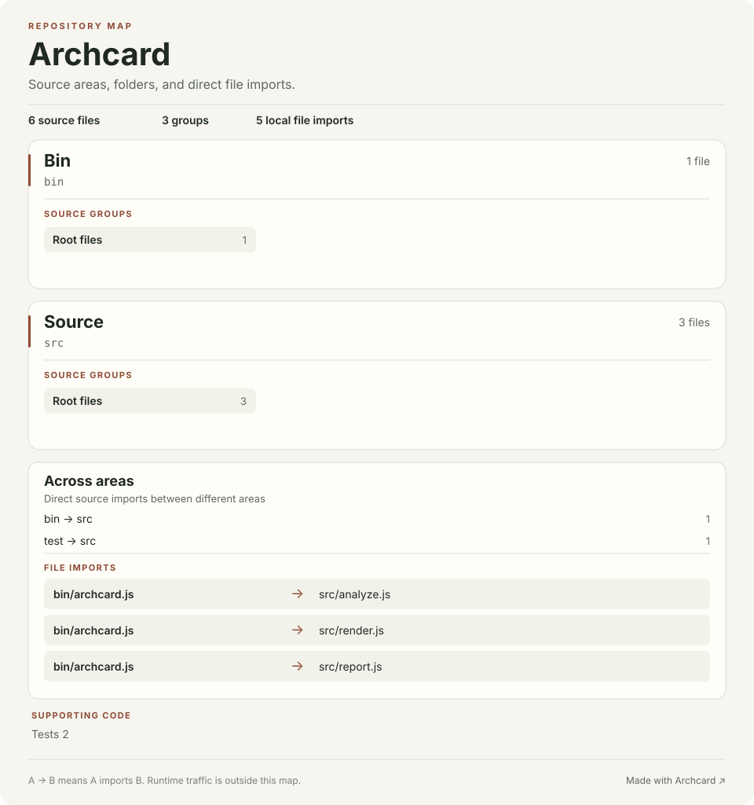

# Archcard source map

This map comes from source files. An arrow means that one local file imports another. It does not show runtime calls, network traffic, or deployments.

6 source files · 3 groups · 5 direct local file imports

## Folder imports

Each count is the number of source files in the first folder that import from the second folder.

| From | Imports | Source files |
| --- | --- | ---: |
| bin | src | 1 |
| test | src | 1 |

## Source files

### bin

#### bin

1 file · JavaScript

| File | Direct local imports |
| --- | --- |
| [archcard.js](../bin/archcard.js) | [src/analyze.js](../src/analyze.js), [src/render.js](../src/render.js), [src/report.js](../src/report.js) |

### src

#### src

3 files · JavaScript

| File | Direct local imports |
| --- | --- |
| [analyze.js](../src/analyze.js) | — |
| [render.js](../src/render.js) | — |
| [report.js](../src/report.js) | — |

### test

#### test

2 files · JavaScript

| File | Direct local imports |
| --- | --- |
| [cli.test.mjs](../test/cli.test.mjs) | — |
| [map.test.mjs](../test/map.test.mjs) | [src/analyze.js](../src/analyze.js), [src/render.js](../src/render.js) |

A missing arrow does not prove that two files are independent. Archcard recognizes common JavaScript, TypeScript, Python, and Rust import forms. [Made with Archcard](https://github.com/skipauthenticate/archcard).
